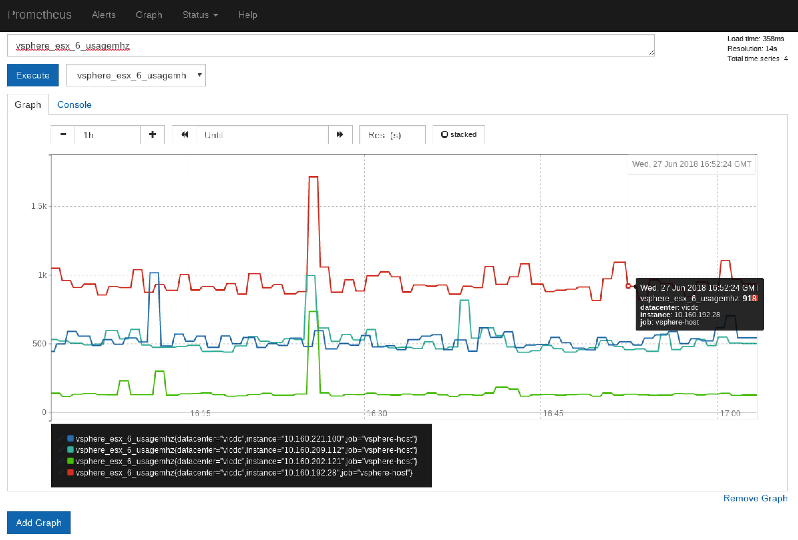

# vSphere Metrics for Prometheus

The vSphere Metrics for Prometheus allows you to scrape metrics for vSphere based infrastructure.

## Architecture

The vSphere Metrics for Prometheus service interacts with the vSphere Service Discovery (SD) embedded within Prometheus (PR pending) and acts as a proxy to provide metrics on a per vSphere entity basis. The vSphere SD mechanism supports multi-vCenter to multi-datacenters within your vSphere infrastructure. Mechanism to support filtering of individual entities or entire logical groupings exists within this model. Support for other VMware platforms (not just vSphere) can be supported in this model (TBD).

#### Architecture Diagram
TODO: Insert your typical awesome architecture diagram here :)

#### Screenshot


## Compatibility

Compatibility is based on the library [govmomi](https://github.com/vmware/govmomi#compatibility) which currently supports ESXi and vCenter 6.0, 6.5, and 6.7.

govmomi should work with versions 5.5 and 5.1, but neither are officially supported. So in turn, vSphere Metrics for Prometheus should work with 5.5 and 5.1 but support will be best-effort in nature.

## Documentation

TODO: This is pending (like a readthedocs.io or something)...

## Installation

Initial installation support is *currently* limited within a Kubernetes environment, but the architecture of this project does not preclude running this on-premises or even within [VMware Cloud on AWS](https://cloud.vmware.com/vmc-aws). This does assume that you have a current running Prometheus configuration prior to deploying this project.

### Installation on Kubernetes

Installation on Kubernetes is fairly straightforward. The vSphere Metrics for Prometheus currently supports metrics for hosts, datastores, and virtual machines. If you want to capture metrics for  each type of the 3 discoverable object type, deploy 3 instances each configured with VSPHERE_TYPE to `esx`, `datastore`, and `virtualmachine` respectively. That can easily be done... It just requires creating the following Kubernetes services [vmp-esx-svc](https://github.com/dvonthenen/vsphere-metrics-prometheus/blob/master/misc/vmp-esx-svc.yaml), [vmp-ds-svc](https://github.com/dvonthenen/vsphere-metrics-prometheus/blob/master/misc/vmp-ds-svc.yaml), [vmp-vm-svc](https://github.com/dvonthenen/vsphere-metrics-prometheus/blob/master/misc/vmp-vm-svc.yaml) and the following deployments [vmp-esx-deploy](https://github.com/dvonthenen/vsphere-metrics-prometheus/blob/master/misc/vmp-esx-deploy.yaml), [vmp-ds-deploy](https://github.com/dvonthenen/vsphere-metrics-prometheus/blob/master/misc/vmp-ds-deploy.yaml), [vmp-vm-deploy](https://github.com/dvonthenen/vsphere-metrics-prometheus/blob/master/misc/vmp-vm-deploy.yaml). Download the deployment and service YAML files, modify the YAML to include your vCenter Server host and credentials, and run the following commands:

```bash
[vmware@k8master ~]$ kubectl apply -f vmp-esx-svc.yaml
service "vmp-esx" created
[vmware@k8master ~]$ kubectl apply -f vmp-ds-svc.yaml
service "vmp-ds" created
[vmware@k8master ~]$ kubectl apply -f vmp-vm-svc.yaml
service "vmp-vm" created
[vmware@k8master ~]$ kubectl apply -f vmp-esx-deploy.yaml
deployment "vmp-esx" created
[vmware@k8master ~]$ kubectl apply -f vmp-ds-deploy.yaml
deployment "vmp-ds" created
[vmware@k8master ~]$ kubectl apply -f vmp-vm-deploy.yaml
deployment "vmp-vm" created
```

That's it! Pretty simple right!

> **Tip**: If you want to kick the tires on vSphere Metrics for Prometheus, you can quickly deploy a non-production Prometheus instance using helm by running the following command (note this is using an image on my personal github currently):
>  
> helm install stable/prometheus --name metrics --version 5.4.1 --set alertmanager.enabled=false --set alertmanager.persistentVolume.enabled=false --set pushgateway.enabled=false --set kubeStateMetrics.enabled=false --set server.persistentVolume.enabled=false --set nodeExporter.enabled=false --set server.service.type=NodePort --set server.image.repository=dvonthenen/prometheus --set server.image.tag=latest --set server.image.pullPolicy=Always -f [prometheus.yml](https://github.com/dvonthenen/vsphere-metrics-prometheus/blob/master/misc/prometheus.yml)
>  
> Download  [prometheus.yml](https://github.com/dvonthenen/vsphere-metrics-prometheus/blob/master/misc/prometheus.yml) and update the values (vcenter_address, vcenter_username, vcenter_password, vcenter_insecure, metrics_proxy_address, metrics_proxy_port) contained at the bottom of the yml file.

### Future Installation Environments

Welcome to different configuration/environment suggestions here...

## Discussion

Contributors and users are encouraged to collaborate using GitHub issues and/or
[Slack](https://vmwarecode.slack.com/messages/kubernetes).
Access to Slack requires a [VMware {code} membership](https://code.vmware.com/join/).

## Status/TODOs

This is an initial release not meant for production workloads yet. Some outstanding items to be worked on:
- Certificate authentication support
- Supports scale-out and high availability but needs proper documentation
- etc

## License

vSphere Metrics for Prometheus is available under the [Apache 2 license](https://github.com/dvonthenen/vsphere-metrics-prometheus/blob/master/LICENSE.txt).
